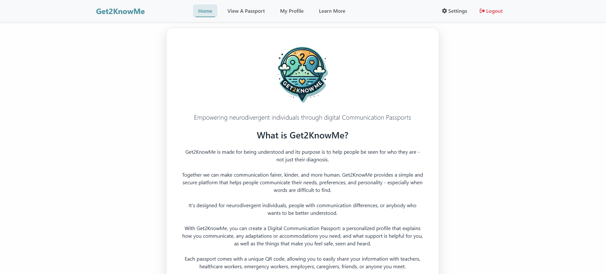
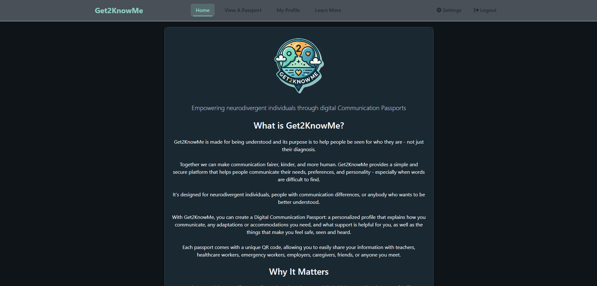
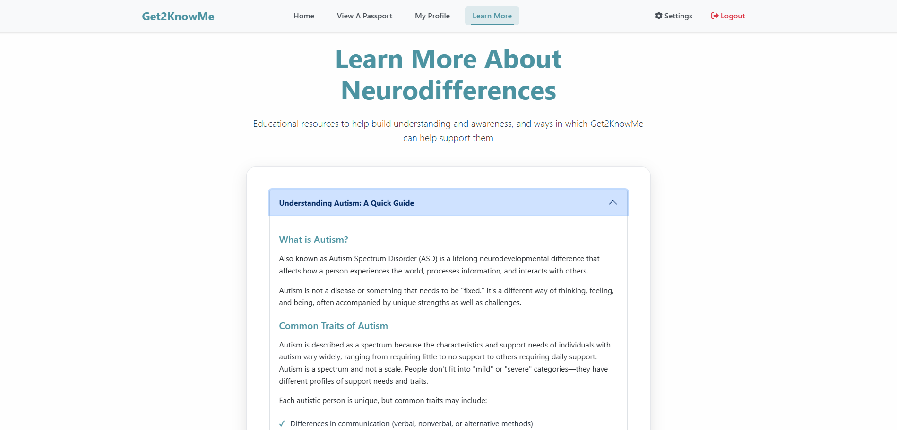
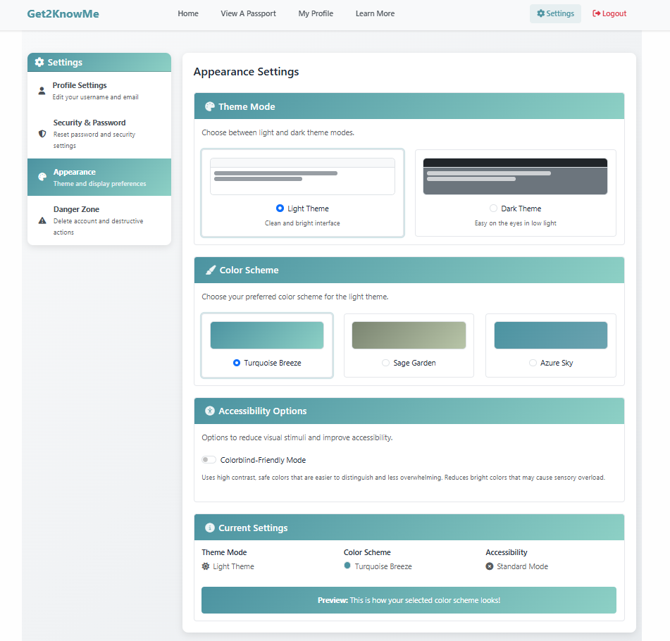
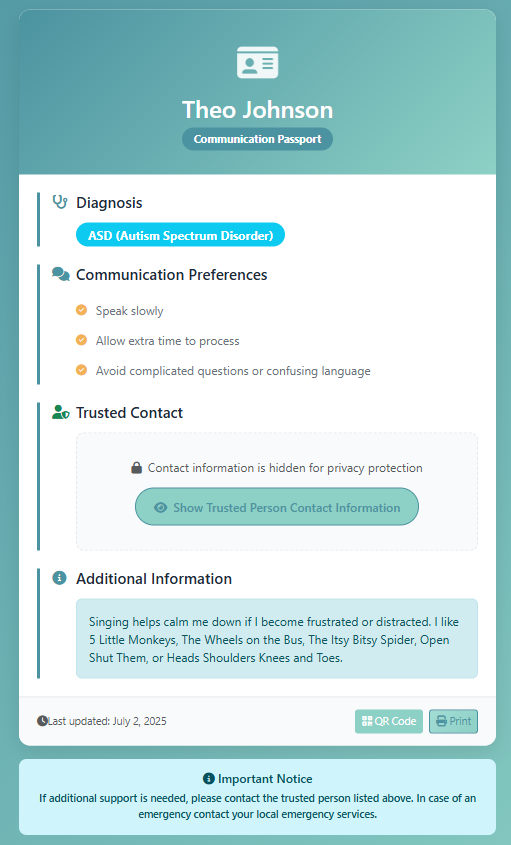
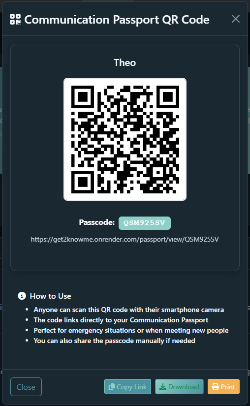

# Get2KnowMe [](https://opensource.org/licenses/MIT)

A web application designed to empower neurodivergent individuals by providing them with a digital platform to create and share their communication needs and preferences with others.

## Description

Get2KnowMe is made for being understood and its purpose is to help people be seen for who they are - not just their diagnosis.

Together we can make communication fairer, kinder, and more human. Get2KnowMe provides a simple and secure platform that helps people communicate their needs, preferences, and personality - especially when words are difficult to find.

It's designed for neurodivergent individuals, people with communication differences, or anybody who wants to be better understood.

With Get2KnowMe, you can create a Digital Communication Passport: a personalized profile that explains how you communicate, any adaptations or accommodations you need, and what support is helpful for you, as well as the things that make you feel safe, seen and heard.

Each passport comes with a unique QR code, allowing you to easily share your information with teachers, healthcare workers, emergency workers, employers, caregivers, friends, or anyone you meet.

## Key Features

- **Digital Communication Passport Creation**: Personalized profiles with communication preferences and support needs
- **QR Code Generation**: Instant sharing capabilities through scannable QR codes
- **Secure Passcode System**: Alternative sharing method using unique alphanumeric codes
- **Trusted Contact Integration**: Emergency contact information with privacy controls
- **Responsive Design**: Optimized for mobile devices and various screen sizes
- **Print-Friendly Format**: Clean, professional printing capabilities for physical copies

## Screenshots


<p align="center"><em><strong>Main landing page with navigation to key features in Light Mode</strong></em></p>


<p align="center"><em><strong>Main landing page with navigation to key features in Dark Mode</strong></em></p>


<p align="center"><em><strong>User profile page with Quick Action panel, allowing easy access to profile customization options</strong></em></p>


<p align="center"><em><strong>Educational information about various neurodivergent conditions and how Get2KnowMe can offer support</strong></em></p>


<p align="center"><em><strong>Appearance setting options, including Light/Dark Modes, color pallate selection, and a colorblind mode</strong></em></p>


<p align="center"><em><strong>Example of a communication passport displaying user preferences and needs</strong></em></p>


<p align="center"><em><strong>QR code generation for easy sharing of communication passports</strong></em></p>


## Table of Contents

- [Installation](#installation)
- [Usage](#usage)
- [Technology Stack](#technology-stack)
- [API Documentation](#api-documentation)
- [Contributing](#contributing)
- [Testing](#testing)
- [Credits](#credits)
- [License](#license)

## Installation

### Live Application
Get2KnowMe is deployed and available for use at: https://get2knowme.co.uk or https://get2know.me

No installation is required - simply visit the website to start creating your communication passport.

### Development Setup

To run Get2KnowMe locally for development or contribution:

1. **Fork and clone the repository**
2. **Install dependencies**
   ```bash
   npm install
   ```
3. **Set up environment variables**
   - Copy `.env.example` to `.env` in the project root:
     ```bash
     cp .env.example .env
     ```
   - Fill in the required values in your `.env` file. Do not commit your actual secrets or production credentials.
   - If you are contributing, use placeholder/test values as provided in `.env.example`.
4. **Start the development server**
   ```bash
   npm run dev
   ```

#### Environment Variables Best Practices
- **Never commit real secrets or production credentials to the repository.**
- Use a `.env.example` file to document all required environment variables and provide safe placeholder values.
- Contributors should create their own `.env` file locally based on `.env.example`.
- Production secrets should only be set in your deployment environment, never in version control.

## Usage

### For Users
1. **Register/Login**: Create an account or log in to access the platform
2. **Create Passport**: Fill out the communication passport form with your preferences and needs
3. **Generate QR Code**: Create a shareable QR code for your passport
4. **Share**: Provide the QR code or passcode to others when communication support is needed

### For Recipients
1. **Scan QR Code**: Use any smartphone camera to scan the provided QR code
2. **Enter Passcode**: Alternatively, visit the lookup page and enter the provided passcode
3. **View Passport**: Access the communication preferences and support information
4. **Contact Support**: Use trusted contact information if additional assistance is needed
            
## Technology Stack

### Frontend
- **React 19.1.0** - Modern JavaScript library for building user interfaces
- **React Router DOM 7.6.3** - Declarative routing for React applications
- **React Bootstrap 2.10.10** - Bootstrap components for React
- **Bootstrap 5.3.7** - CSS framework for responsive design
- **Vite 7.0.0** - Fast build tool and development server

### Backend
- **Node.js** - JavaScript runtime environment
- **Express.js 4.19.2** - Web application framework
- **MongoDB** - NoSQL database for data storage
- **Mongoose 8.16.1** - MongoDB object modeling library

### Authentication & Security
- **JSON Web Tokens 9.0.2** - Secure authentication mechanism
- **bcrypt 6.0.0** - Password hashing library
- **JWT Decode 4.0.0** - JWT token decoding utility

### Additional Libraries
- **QRCode 1.5.4** - QR code generation
- **@zxing/library 0.21.3** - QR code scanning functionality
- **libphonenumber-js 1.12.9** - Phone number validation and formatting
- **react-phone-number-input 3.4.12** - Phone number input component
- **Font Awesome 6.5.1** - Icon library via CDN
- **CORS 2.8.5** - Cross-origin resource sharing middleware

### Development Tools
- **ESLint** - Code linting and formatting
- **Concurrently** - Run multiple npm scripts simultaneously
- **Vite React Plugin** - React support for Vite

## API Documentation

### Authentication Endpoints
- `POST /api/users/register` - User registration
- `POST /api/users/login` - User authentication
- `GET /api/users/me` - Get current user profile

### Passport Endpoints
- `POST /api/passport/create` - Create communication passport
- `PUT /api/passport/update` - Update existing passport
- `GET /api/passport/:passcode` - Retrieve passport by passcode
- `DELETE /api/passport/delete` - Delete user's passport

## Contributing

We welcome contributions from the community! To get started:

1. Fork this repository
2. Create a new branch for your feature or fix (`git checkout -b feature/your-feature-name`)
3. Make your changes and commit them (`git commit -m 'Describe your change'`)
4. Push your branch to your fork (`git push origin feature/your-feature-name`)
5. Open a Pull Request describing your changes

### Contribution Guidelines
- Follow existing code style and conventions
- Write clear, descriptive commit messages
- Update or add documentation as needed
- Be respectful and inclusive in all communications

If you have questions about environment variables or setup, please open an issue or discussion!

## Testing

### Manual Testing
The application includes comprehensive manual testing procedures for:
- User registration and authentication
- Passport creation and editing
- QR code generation and scanning
- Passcode lookup functionality
- Responsive design across devices

### Reporting Issues
If you experience any issues with the application, please:
1. Check existing issues on GitHub
2. Provide detailed steps to reproduce the problem
3. Include error messages and browser information
4. Contact [dljohnson1313@gmail.com](mailto:dljohnson1313@gmail.com) for urgent issues

## Credits

### Development Team

**Lead Developer**  
Devyn Johnson
- [GitHub Profile](https://www.github.com/DevynJohnson)  
- [Portfolio](https://devynjohnson.me)  
- [LinkedIn](https://www.linkedin.com/in/devyn-johnson-a5259213b/)

**Contributor**  
Jake Barry


### Acknowledgments

Special thanks to the neurodivergent community, healthcare professionals, and behavioral health experts for their insights and feedback during the development of this application.

### Third-Party Resources

#### Core Technologies
- [React](https://react.dev) - Component-based UI library
- [Vite](https://vite.dev) - Fast build tool and development server
- [Node.js](https://nodejs.org) - JavaScript runtime environment
- [Express.js](https://expressjs.com) - Web application framework
- [MongoDB](https://www.mongodb.com) - NoSQL database

#### UI/UX Libraries
- [Bootstrap](https://getbootstrap.com) - CSS framework
- [React Bootstrap](https://react-bootstrap.github.io) - Bootstrap components for React
- [Font Awesome](https://fontawesome.com) - Icon library

#### Utility Libraries
- [QRCode](https://www.npmjs.com/package/qrcode) - QR code generation
- [ZXing](https://github.com/zxing-js/library) - QR code scanning
- [libphonenumber-js](https://www.npmjs.com/package/libphonenumber-js) - Phone number utilities
- [React Router](https://reactrouter.com) - Client-side routing
- [Mongoose](https://mongoosejs.com) - MongoDB object modeling

#### Security & Authentication
- [JSON Web Tokens](https://jwt.io) - Secure token-based authentication
- [bcrypt](https://www.npmjs.com/package/bcrypt) - Password hashing
- [CORS](https://www.npmjs.com/package/cors) - Cross-origin resource sharing

#### Development Tools
- [ESLint](https://eslint.org) - JavaScript linting
- [Concurrently](https://www.npmjs.com/package/concurrently) - Parallel script execution
            
## License
MIT License

Copyright (c) 2025 Devyn Johnson

Permission is hereby granted, free of charge, to any person obtaining a copy of this software and associated documentation files (the "Software"), to deal in the Software without restriction, including without limitation the rights to use, copy, modify, merge, publish, distribute, sublicense, and/or sell copies of the Software, and to permit persons to whom the Software is furnished to do so, subject to the following conditions:

The above copyright notice and this permission notice shall be included in all copies or substantial portions of the Software.

THE SOFTWARE IS PROVIDED "AS IS", WITHOUT WARRANTY OF ANY KIND, EXPRESS OR IMPLIED, INCLUDING BUT NOT LIMITED TO THE WARRANTIES OF MERCHANTABILITY, FITNESS FOR A PARTICULAR PURPOSE AND NONINFRINGEMENT. IN NO EVENT SHALL THE AUTHORS OR COPYRIGHT HOLDERS BE LIABLE FOR ANY CLAIM, DAMAGES OR OTHER LIABILITY, WHETHER IN AN ACTION OF CONTRACT, TORT OR OTHERWISE, ARISING FROM, OUT OF OR IN CONNECTION WITH THE SOFTWARE OR THE USE OR OTHER DEALINGS IN THE SOFTWARE.

---

*Get2KnowMe - Empowering communication through technology*
