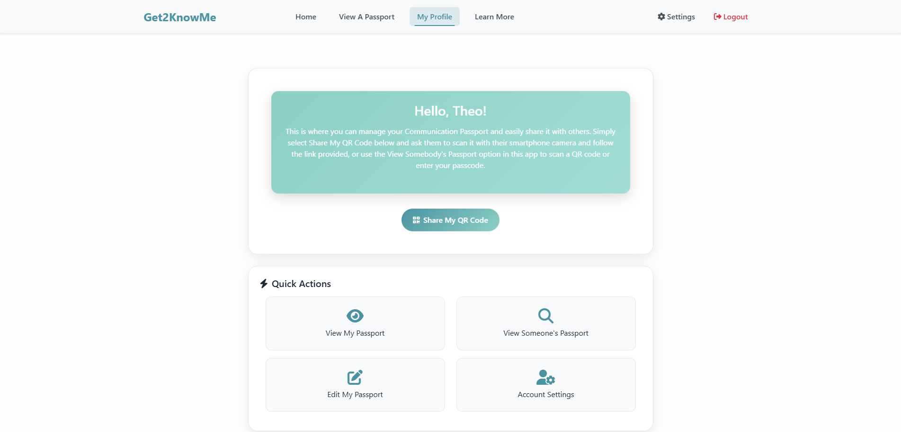

# Get2KnowMe

A web application designed to empower neurodivergent individuals by providing them with a digital platform to create and share their communication needs and preferences with others.

## Description

Get2KnowMe is made for being understood and its purpose is to help people be seen for who they are - not just their diagnosis.

Together we can make communication fairer, kinder, and more human. Get2KnowMe provides a simple and secure platform that helps people communicate their needs, preferences, and personality - especially when words are difficult to find.

It's designed for neurodivergent individuals, people with communication differences, or anybody who wants to be better understood.

With Get2KnowMe, you can create a Digital Communication Passport: a personalized profile that explains how you communicate, any adaptations or accommodations you need, and what support is helpful for you, as well as the things that make you feel safe, seen and heard.

Each passport comes with a unique QR code, allowing you to easily share your information with teachers, healthcare workers, emergency workers, employers, caregivers, friends, or anyone you meet.

## Key Features

- **Digital Communication Passport Creation**: Personalized profiles with communication preferences and support needs
- **QR Code Generation**: Instant sharing capabilities through scannable QR codes
- **Secure Passcode System**: Alternative sharing method using unique alphanumeric codes
- **Trusted Contact Integration**: Emergency contact information with privacy controls
- **Responsive Design**: Optimized for mobile devices and various screen sizes
- **Print-Friendly Format**: Clean, professional printing capabilities for physical copies

## Screenshots

<em><strong>Main landing page with navigation to key features in Light Mode</strong></em>

<em><strong>Main landing page with navigation to key features in Dark Mode</strong></em>

<em><strong>User profile page with Quick Action panel, allowing easy access to profile customization options</strong></em>

<em><strong>Educational information about various neurodivergent conditions and how Get2KnowMe can offer support</strong></em>

<em><strong>Appearance setting options, including Light/Dark Modes, color pallate selection, and a colorblind mode</strong></em>

<em><strong>Example of a communication passport displaying user preferences and needs</strong></em>

<em><strong>QR code generation for easy sharing of communication passports</strong></em>

## Table of Contents

- [Installation](#installation)
- [Usage](#usage)
- [Technology Stack](#technology-stack)
- [API Documentation](#api-documentation)
- [Contributing](#contributing)
- [Testing](#testing)
- [Credits](#credits)
- [License](#license)

## Installation

### Live Application
Get2KnowMe is deployed and available for use at: https://get2knowme.onrender.com

No installation is required - simply visit the website to start creating your communication passport.

### Development Setup (For Authorized Contributors Only)

This is a proprietary application with restricted access. Development setup requires:

- Authorization from the project owner
- Access to private environment configuration
- Database credentials and API keys

**For development access, please contact [dljohnson1313@gmail.com](mailto:dljohnson1313@gmail.com)**

#### Technical Requirements
- Node.js (v18 or higher)
- MongoDB database access
- Environment configuration files
- Git access to private repository

## Usage

### For Users
1. **Register/Login**: Create an account or log in to access the platform
2. **Create Passport**: Fill out the communication passport form with your preferences and needs
3. **Generate QR Code**: Create a shareable QR code for your passport
4. **Share**: Provide the QR code or passcode to others when communication support is needed

### For Recipients
1. **Scan QR Code**: Use any smartphone camera to scan the provided QR code
2. **Enter Passcode**: Alternatively, visit the lookup page and enter the provided passcode
3. **View Passport**: Access the communication preferences and support information
4. **Contact Support**: Use trusted contact information if additional assistance is needed
            
## Technology Stack

### Frontend
- **React 19.1.0** - Modern JavaScript library for building user interfaces
- **React Router DOM 7.6.3** - Declarative routing for React applications
- **React Bootstrap 2.10.10** - Bootstrap components for React
- **Bootstrap 5.3.7** - CSS framework for responsive design
- **Vite 7.0.0** - Fast build tool and development server

### Backend
- **Node.js** - JavaScript runtime environment
- **Express.js 4.19.2** - Web application framework
- **MongoDB** - NoSQL database for data storage
- **Mongoose 8.16.1** - MongoDB object modeling library

### Authentication & Security
- **JSON Web Tokens 9.0.2** - Secure authentication mechanism
- **bcrypt 6.0.0** - Password hashing library
- **JWT Decode 4.0.0** - JWT token decoding utility

### Additional Libraries
- **QRCode 1.5.4** - QR code generation
- **@zxing/library 0.21.3** - QR code scanning functionality
- **libphonenumber-js 1.12.9** - Phone number validation and formatting
- **react-phone-number-input 3.4.12** - Phone number input component
- **Font Awesome 6.5.1** - Icon library via CDN
- **CORS 2.8.5** - Cross-origin resource sharing middleware

### Development Tools
- **ESLint** - Code linting and formatting
- **Concurrently** - Run multiple npm scripts simultaneously
- **Vite React Plugin** - React support for Vite

## API Documentation

### Authentication Endpoints
- `POST /api/users/register` - User registration
- `POST /api/users/login` - User authentication
- `GET /api/users/me` - Get current user profile

### Passport Endpoints
- `POST /api/passport/create` - Create communication passport
- `PUT /api/passport/update` - Update existing passport
- `GET /api/passport/:passcode` - Retrieve passport by passcode
- `DELETE /api/passport/delete` - Delete user's passport

## Contributing

Get2KnowMe is a proprietary application with **invitation-only contributions**. We carefully select contributors who align with our mission and values.

### How to Get Involved

**For potential contributors:**
- Contact [dljohnson1313@gmail.com](mailto:dljohnson1313@gmail.com) to express your interest
- Include your background, relevant experience, and how you'd like to contribute
- Authorization is required before any development access is granted

**For authorized contributors:**
1. Receive development environment setup instructions
2. Create a feature branch (`git checkout -b feature/amazing-feature`)
3. Follow established code standards and guidelines
4. Submit changes through approved channels
5. Participate in code review process

### Contribution Guidelines (For Authorized Contributors)
- Follow existing code style and conventions
- Write clear, descriptive commit messages
- Update documentation as needed
- Respect proprietary code and confidentiality requirements

## Testing

### Manual Testing
The application includes comprehensive manual testing procedures for:
- User registration and authentication
- Passport creation and editing
- QR code generation and scanning
- Passcode lookup functionality
- Responsive design across devices

### Reporting Issues
If you experience any issues with the application, please:
1. Check existing issues on GitHub
2. Provide detailed steps to reproduce the problem
3. Include error messages and browser information
4. Contact [dljohnson1313@gmail.com](mailto:dljohnson1313@gmail.com) for urgent issues

## Credits

### Development Team

**Lead Developer**  
Devyn Johnson  
- [GitHub Profile](https://www.github.com/DevynJohnson)  
- [Portfolio](https://devynjohnson.me)  
- [LinkedIn](https://www.linkedin.com/in/devyn-johnson-a5259213b/)

**Contributor**  
Jake Barry

### Acknowledgments

Special thanks to the neurodivergent community, healthcare professionals, and behavioral health experts for their insights and feedback during the development of this application.

### Third-Party Resources

#### Core Technologies
- [React](https://react.dev) - Component-based UI library
- [Vite](https://vite.dev) - Fast build tool and development server
- [Node.js](https://nodejs.org) - JavaScript runtime environment
- [Express.js](https://expressjs.com) - Web application framework
- [MongoDB](https://www.mongodb.com) - NoSQL database

#### UI/UX Libraries
- [Bootstrap](https://getbootstrap.com) - CSS framework
- [React Bootstrap](https://react-bootstrap.github.io) - Bootstrap components for React
- [Font Awesome](https://fontawesome.com) - Icon library

#### Utility Libraries
- [QRCode](https://www.npmjs.com/package/qrcode) - QR code generation
- [ZXing](https://github.com/zxing-js/library) - QR code scanning
- [libphonenumber-js](https://www.npmjs.com/package/libphonenumber-js) - Phone number utilities
- [React Router](https://reactrouter.com) - Client-side routing
- [Mongoose](https://mongoosejs.com) - MongoDB object modeling

#### Security & Authentication
- [JSON Web Tokens](https://jwt.io) - Secure token-based authentication
- [bcrypt](https://www.npmjs.com/package/bcrypt) - Password hashing
- [CORS](https://www.npmjs.com/package/cors) - Cross-origin resource sharing

#### Development Tools
- [ESLint](https://eslint.org) - JavaScript linting
- [Concurrently](https://www.npmjs.com/package/concurrently) - Parallel script execution
            
## License

This project is proprietary software under exclusive copyright. 

**Copyright © 2025 Devyn Johnson. All rights reserved.**

No part of this software may be reproduced, distributed, modified, or sold without express written permission from the author. This includes but is not limited to:
- Source code
- Documentation
- Design assets
- User interface elements

For licensing inquiries or permission requests, please contact [dljohnson1313@gmail.com](mailto:dljohnson1313@gmail.com).

---

*Get2KnowMe - Empowering communication through technology*
