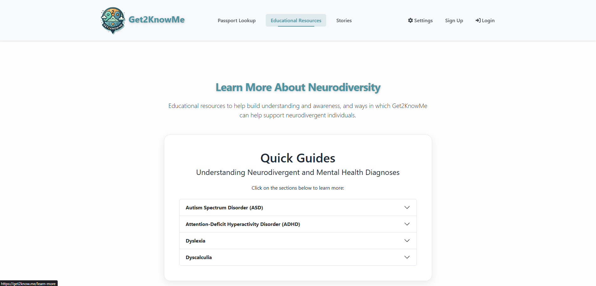

# Get2KnowMe [](https://opensource.org/licenses/MIT)

A web application designed to empower neurodivergent individuals by providing them with a digital platform to create and share their communication needs and preferences with others.

## Description

Get2KnowMe is made for being understood and its purpose is to help people be seen for who they are - not just their diagnosis.

Together we can make communication fairer, kinder, and more human. Get2KnowMe provides a simple and secure platform that helps people communicate their needs, preferences, and personality - especially when words are difficult to find.

It's designed for neurodivergent individuals, people with communication differences, or anybody who wants to be better understood.

With Get2KnowMe, you can create a Digital Communication Passport: a personalized profile that explains how you communicate, any adaptations or accommodations you need, and what support is helpful for you, as well as the things that make you feel safe, seen and heard.

Each passport comes with a unique QR code, allowing you to easily share your information with teachers, healthcare workers, emergency workers, employers, caregivers, friends, or anyone you meet.


## Key Features

- **Digital Communication Passport Creation**: Personalized profiles with communication preferences and support needs
- **QR Code Generation**: Instant sharing capabilities through scannable QR codes
- **Secure Passcode System**: Alternative sharing method using unique alphanumeric codes
- **Trusted Contact Integration**: Emergency contact information with privacy controls
- **Follow & Notification System**: Users can follow others to receive notifications when a communication passport is updated—ideal for caregivers, educators, or support teams who need to stay informed about changes.
- **Privacy Controls for Social Features**: Users can toggle their ability to receive follow requests and choose to be excluded from search results for added privacy and security. These options are available in Profile Settings.
- **Responsive Design**: Optimized for mobile devices and various screen sizes
- **Print-Friendly Format**: Clean, professional printing capabilities for physical copies
- **Accessibility Options**: Accessibility customization options including toggle on/off options for colorblindness and dyslexia-friendly fonts
- **Advanced Security & Data Encryption**: All sensitive personal data is encrypted at rest and protected by strong authentication, ensuring your information is always safe
- **Enterprise-Grade Security**: Rate limiting, Content Security Policy (CSP), comprehensive logging, and session management protect against common web vulnerabilities

## Screenshots


<p align="center"><em><strong>Main landing page with navigation to key features</strong></em></p>


<p align="center"><em><strong>User profile page with Quick Action panel, allowing easy access to profile customization options</strong></em></p>


<p align="center"><em><strong>Educational information about various neurodivergent conditions and how Get2KnowMe can offer support</strong></em></p>


<p align="center"><em><strong>Appearance setting options, including Light/Dark Modes, color pallate selection, and a colorblind mode</strong></em></p>


<p align="center"><em><strong>Example of a communication passport displaying user preferences and needs</strong></em></p>


<p align="center"><em><strong>QR code generation for easy sharing of communication passports</strong></em></p>


## Table of Contents

- [Installation](#installation)
- [Usage](#usage)
- [Technology Stack](#technology-stack)
- [Security Features](#security-features)
- [API Documentation](#api-documentation)
- [Contributing](#contributing)
- [Testing](#testing)
- [Credits](#credits)
- [GDPR & Privacy Compliance](#gdpr--privacy-compliance)
- [License](#license)

## Installation

### Live Application
Get2KnowMe is deployed and available for use at: https://get2knowme.co.uk or https://get2know.me

No installation is required - simply visit the website to start creating your communication passport.

### Development Setup

To run Get2KnowMe locally for development or contribution:

1. **Fork and clone the repository**
2. **Install dependencies**
   ```bash
   npm install
   ```
3. **Set up environment variables**
   - Copy `.env.example` to `.env` in the project root:
     ```bash
     cp .env.example .env
     ```
   - Fill in the required values in your `.env` file. Do not commit your actual secrets or production credentials.
   - If you are contributing, use placeholder/test values as provided in `.env.example`.
4. **Start the development server**
   ```bash
   npm run dev
   ```

#### Environment Variables Best Practices
- **Never commit real secrets or production credentials to the repository.**
- Use a `.env.example` file to document all required environment variables and provide safe placeholder values.
- Contributors should create their own `.env` file locally based on `.env.example`.
- Production secrets should only be set in your deployment environment, never in version control.

## Usage

### For Users
1. **Register/Login**: Create an account or log in to access the platform
2. **Create Passport**: Fill out the communication passport form with your preferences and needs
3. **Generate QR Code**: Create a shareable QR code for your passport
4. **Share**: Provide the QR code or passcode to others when communication support is needed

### For Recipients
1. **Scan QR Code**: Use any smartphone camera to scan the provided QR code
2. **Enter Passcode**: Alternatively, visit the lookup page and enter the provided passcode
3. **View Passport**: Access the communication preferences and support information
4. **Contact Support**: Use trusted contact information if additional assistance is needed
            
## Technology Stack

### Frontend
- **React 19.1.0** - Modern JavaScript library for building user interfaces
- **React DOM 19.1.0** - DOM bindings for React
- **React Router DOM 7.6.3** - Declarative routing for React applications
- **React Bootstrap 2.10.10** - Bootstrap components for React
- **Bootstrap 5.3.7** - CSS framework for responsive design
- **Vite 7.0.0** - Fast build tool and development server
- **@vitejs/plugin-react 4.5.2** - Vite plugin for React
- **@fortawesome/react-fontawesome 0.2.3** - Font Awesome React components
- **@fortawesome/fontawesome-svg-core 7.0.0** - Font Awesome core library
- **@fortawesome/free-solid-svg-icons 7.0.0** - Font Awesome icon set
- **QRCode 1.5.4** - QR code generation
- **@zxing/library 0.21.3** - QR code scanning
- **jwt-decode 4.0.0** - JWT decoding utility
- **react-phone-number-input 3.4.12** - Phone number input component

### Backend
- **Node.js** - JavaScript runtime environment
- **Express.js 4.19.2** - Web application framework
- **MongoDB** - NoSQL database for data storage
- **Mongoose 8.16.1** - MongoDB object modeling library
- **bcrypt 6.0.0** - Password hashing
- **jsonwebtoken 9.0.2** - JWT authentication
- **mongoose-field-encryption 7.0.1** - Field-level encryption for sensitive data
- **cors 2.8.5** - Cross-origin resource sharing
- **resend 4.6.0** - Transactional email delivery

### Security & Infrastructure
- **helmet 8.1.0** - Security headers and Content Security Policy (CSP)
- **express-rate-limit 8.0.1** - Rate limiting middleware for DDoS protection
- **express-validator 7.2.1** - Input validation and sanitization
- **compression 1.8.1** - Response compression for improved performance
- **morgan 1.10.1** - HTTP request logging middleware
- **winston 3.17.0** - Advanced logging framework with multiple transports
- **cookie-parser 1.4.7** - Cookie parsing middleware
- **connect-mongo 5.1.0** - MongoDB session store for secure session management

### Authentication & Security
- **Email Confirmation Required**: All new users must confirm their email address via a secure, expiring link before their account is activated. Confirmation links are single-use and expire after 24 hours for security.
- **JSON Web Tokens 9.0.2** - Secure authentication mechanism
- **bcrypt 6.0.0** - Password hashing library
- **JWT Decode 4.0.0** - JWT token decoding utility
- **mongoose-field-encryption 7.0.1** - Field-level encryption for sensitive data in MongoDB

### Additional Libraries
- **libphonenumber-js 1.12.9** - Phone number validation and formatting
- **Font Awesome** - Icon library (via npm)
- **Terser 5.43.1** - JavaScript minification and optimization

### Development Tools
- **ESLint 9.29.0** - Code linting and formatting
- **Concurrently 9.2.0** - Run multiple npm scripts simultaneously
- **Vite React Plugin 4.5.2** - React support for Vite
- **Terser 5.43.1** - JavaScript minification and optimization
- **eslint-plugin-react-hooks 5.2.0**
- **eslint-plugin-react-refresh 0.4.20**
- **@eslint/js 9.29.0**
- **@types/react 19.1.8**
- **@types/react-dom 19.1.6**
- **globals 16.2.0**

### Testing
### Testing
- **Jest 30.0.4** - JavaScript testing framework for unit and integration tests
- **Supertest 7.1.1** - HTTP endpoint testing for API validation
- **MongoDB Memory Server 10.1.4** - In-memory database for isolated testing
- **Puppeteer 24.15.0** - Browser automation for end-to-end testing
- **Axios 1.11.0** - HTTP client library for API testing

## Security Features

Get2KnowMe implements comprehensive security measures to protect user data and ensure platform integrity:

### Application Security
- **Content Security Policy (CSP)**: Strict CSP headers prevent XSS attacks and unauthorized resource loading
- **Security Headers**: Helmet.js implements security best practices including HSTS, X-Frame-Options, and more
- **Rate Limiting**: Intelligent rate limiting protects against brute force attacks and API abuse
- **Input Validation**: All user inputs are validated and sanitized using express-validator
- **Session Security**: Secure session management with MongoDB-backed session storage
- **HTTPS Enforcement**: All data transmission is encrypted in transit

### Data Protection
- **Field-Level Encryption**: Sensitive user data is encrypted at the database level using mongoose-field-encryption
- **Password Security**: Passwords are hashed using bcrypt with secure salt rounds
- **JWT Authentication**: Stateless authentication with secure token management
- **Data Minimization**: Only essential data is collected and stored

### Infrastructure Security
- **Comprehensive Logging**: Winston-based logging system tracks security events and system activities
- **Request Logging**: Morgan middleware logs all HTTP requests for monitoring and security analysis
- **Compression Security**: Response compression is implemented safely to prevent BREACH attacks
- **Cookie Security**: Secure cookie handling with proper SameSite and HttpOnly flags

### Privacy by Design
- **User Search Privacy**: Full username or valid passcode required for user discovery
- **Social Privacy Controls**: Users can opt out of search results and follow requests
- **Minimal Data Collection**: Only data necessary for core functionality is collected
- **Granular Privacy Settings**: Users have full control over their data visibility

## API Documentation

### User & Authentication Endpoints (`/api/users`)
- `POST /signup` — Register a new user (sends confirmation email)
- `GET /confirm-email` — Confirm user email address via token
- `POST /login` — User authentication
- `PUT /update-username` — Update username
- `PUT /update-email` — Update email
- `PUT /change-password` — Change password
- `POST /request-password-reset` — Request password reset email
- `POST /reset-password` — Reset password using token
- `DELETE /delete-account` — Delete user account
- `POST /export-data` — Export user data (GDPR)
- `POST /start-parental-consent` — Start parental consent workflow (underage registration)
- `POST /send-parental-consent` — Send parental consent email (manual/legacy use)
- `GET /consent` — Parental consent approval (tokenized link)
- `GET /consent/declined` — Parental consent declined (tokenized link)

### Passport Endpoints (`/api/passport`)
- `GET /generate-passcode` — Generate a new passcode
- `POST /create` — Create or update communication passport
- `GET /my-passport` — Get current user's passport
- `GET /public/:passcode` — Retrieve passport by passcode (public)
- `DELETE /delete` — Delete user's passport

### Follow Endpoints (`/api/follow`)
- `GET /search` — Search for users to follow
- `POST /request/:userId` — Send follow request
- `POST /accept/:fromUserId` — Accept follow request
- `POST /reject/:fromUserId` — Reject follow request
- `POST /unfollow/:userId` — Unfollow user
- `GET /followers` — Get user's followers
- `GET /following` — Get users being followed
- `GET /requests/pending` — Get pending follow requests (received)
- `GET /requests/sent` — Get sent follow requests
- `DELETE /request/cancel/:userId` — Cancel sent follow request

### Notification Endpoints (`/api/notifications`)
- `GET /` — Get user's notifications
- `GET /hidden` — Get hidden notification preferences
- `POST /hide/:userId` — Hide notifications from a user
- `POST /unhide/:userId` — Unhide notifications from a user
- `PATCH /:notificationId/read` — Mark notification as read
- `PATCH /mark-all-read` — Mark all notifications as read
- `DELETE /:notificationId` — Delete notification
- `GET /counts` — Get notification counts by type

### Stories Endpoints (`/api/stories`)
- `POST /` — Create a new story
- `PUT /:id` — Update a story by ID

## Contributing

We welcome contributions from the community! To get started:

1. Fork this repository
2. Create a new branch for your feature or fix (`git checkout -b feature/your-feature-name`)
3. Make your changes and commit them (`git commit -m 'Describe your change'`)
4. Push your branch to your fork (`git push origin feature/your-feature-name`)
5. Open a Pull Request describing your changes

### Contribution Guidelines
- Follow existing code style and conventions
- Write clear, descriptive commit messages
- Update or add documentation as needed
- Be respectful and inclusive in all communications

If you have questions about environment variables or setup, please open an issue or reach out to [enquiries@get2knowme.co.uk]!

## Testing

### Automated Testing
The application includes comprehensive testing with:
- **Jest 30.0.4** - JavaScript testing framework for unit and integration tests
- **Supertest 7.1.1** - HTTP endpoint testing for API validation
- **MongoDB Memory Server 10.1.4** - In-memory database for isolated testing
- **Puppeteer 24.15.0** - Browser automation for end-to-end testing
- **Axios 1.11.0** - HTTP client library for API testing

### Test Suites
The application includes multiple test approaches:

#### Unit & Integration Tests
```bash
npm run test
```
Runs Jest-based unit and integration tests for API endpoints and core functionality.

#### Endpoint Health Testing
```bash
npm run test:endpoints
```
Comprehensive browser automation testing using Puppeteer to verify all frontend routes load correctly, FontAwesome icons render properly, and no JavaScript errors occur.

#### API Health Testing
```bash
npm run test:api
```
Backend API endpoint testing to verify server functionality and response codes.

#### Quick Endpoint Testing
```bash
npm run test:quick
```
Fast frontend endpoint verification that checks all routes return 200 status codes and counts FontAwesome icon usage.

#### Comprehensive Testing
```bash
npm run test:all
```
Runs all available test suites for complete application validation.

### Test Infrastructure
The testing infrastructure includes:
- **endpoint-health-check.js** - Browser automation testing with Puppeteer
- **api-health-check.js** - Backend API endpoint validation
- **quick-endpoint-test.js** - Fast frontend route verification
- **manual-endpoint-test.js** - Manual testing guidance and procedures
- **check-server-status.js** - Development server connectivity verification

### Manual Testing
The application includes comprehensive manual testing procedures for:
- User registration and authentication
- Passport creation and editing
- QR code generation and scanning
- Passcode lookup functionality
- Responsive design across devices

### Reporting Issues
If you experience any issues with the application, please:
1. Check existing issues on GitHub
2. Provide detailed steps to reproduce the problem
3. Include error messages and browser information
4. Contact [enquiries@get2knowme.co.uk](mailto:enquiries@get2knowme.co.uk) for urgent issues

## Credits

### Development Team

**Lead Developer**  
Devyn Johnson - Frontend/Backend Engineer
- [GitHub Profile](https://www.github.com/DevynJohnson)  
- [Portfolio](https://devynjohnson.me)  
- [LinkedIn](https://www.linkedin.com/in/devyn-johnson-a5259213b/)

**Contributor**  
Jake Barry - Conception, Content Creation
- [GitHub Profile](https://www.github.com/jakeb1991)  


### Acknowledgments

Special thanks to the neurodivergent community, healthcare professionals, and behavioral health experts for their insights and feedback during the development of this application.

### Third-Party Resources

#### Core Technologies
- [React](https://react.dev) - Component-based UI library
- [Vite](https://vite.dev) - Fast build tool and development server
- [Node.js](https://nodejs.org) - JavaScript runtime environment
- [Express.js](https://expressjs.com) - Web application framework
- [MongoDB](https://www.mongodb.com) - NoSQL database

#### UI/UX Libraries
- [Bootstrap](https://getbootstrap.com) - CSS framework
- [React Bootstrap](https://react-bootstrap.github.io) - Bootstrap components for React
- [Font Awesome](https://fontawesome.com) - Icon library

#### Utility Libraries
- [QRCode](https://www.npmjs.com/package/qrcode) - QR code generation
- [ZXing](https://github.com/zxing-js/library) - QR code scanning
- [libphonenumber-js](https://www.npmjs.com/package/libphonenumber-js) - Phone number utilities
- [React Router](https://reactrouter.com) - Client-side routing
- [Mongoose](https://mongoosejs.com) - MongoDB object modeling

#### Email & Transactional Messaging
- [Resend](https://resend.com/) - Transactional email delivery service (used for password reset and notifications)

#### Security & Authentication
- [JSON Web Tokens](https://jwt.io) - Secure token-based authentication
- [bcrypt](https://www.npmjs.com/package/bcrypt) - Password hashing
- [mongoose-field-encryption](https://www.npmjs.com/package/mongoose-field-encryption) - Field-level encryption for sensitive data
- [CORS](https://www.npmjs.com/package/cors) - Cross-origin resource sharing
- [Helmet](https://helmetjs.github.io/) - Security headers and Content Security Policy implementation
- [Express Rate Limit](https://www.npmjs.com/package/express-rate-limit) - Rate limiting middleware for API protection
- [Express Validator](https://express-validator.github.io/) - Input validation and sanitization

#### Infrastructure & Performance
- [Compression](https://www.npmjs.com/package/compression) - Response compression middleware
- [Morgan](https://www.npmjs.com/package/morgan) - HTTP request logging
- [Winston](https://github.com/winstonjs/winston) - Advanced logging framework
- [Cookie Parser](https://www.npmjs.com/package/cookie-parser) - Cookie parsing middleware
- [Connect MongoDB Session](https://www.npmjs.com/package/connect-mongo) - MongoDB session store

#### Development Tools
- [ESLint](https://eslint.org) - JavaScript linting
- [Concurrently](https://www.npmjs.com/package/concurrently) - Parallel script execution
- [Vite React Plugin](https://www.npmjs.com/package/@vitejs/plugin-react) - Vite plugin for React
- [eslint-plugin-react-hooks](https://www.npmjs.com/package/eslint-plugin-react-hooks) - ESLint plugin for React hooks
- [eslint-plugin-react-refresh](https://www.npmjs.com/package/eslint-plugin-react-refresh) - ESLint plugin for React Fast Refresh
- [@types/react](https://www.npmjs.com/package/@types/react) - TypeScript type definitions for React
- [@types/react-dom](https://www.npmjs.com/package/@types/react-dom) - TypeScript type definitions for ReactDOM
- [globals](https://www.npmjs.com/package/globals) - List of global identifiers

#### Testing Tools
- [Jest](https://jestjs.io) - JavaScript testing framework
- [Supertest](https://www.npmjs.com/package/supertest) - HTTP assertions for integration testing
- [mongodb-memory-server](https://www.npmjs.com/package/mongodb-memory-server) - In-memory MongoDB server for testing
- [Puppeteer](https://pptr.dev/) - Browser automation for end-to-end testing
- [Axios](https://axios-http.com/) - HTTP client library for API testing
            
## GDPR & Privacy Compliance

Get2KnowMe is committed to protecting user privacy and complying with the General Data Protection Regulation (GDPR) and other relevant privacy laws. Our comprehensive privacy framework includes:

### Legal Compliance
- **Explicit Consent**: Users must provide explicit consent to the Terms of Service and Privacy Policy during registration, including age confirmation and agreement to data processing.
- **Right of Access & Deletion**: Users can access, export, or delete their data at any time via the application interface or by contacting support.
- **Data Portability**: Full data export functionality allows users to download their information in a structured format.
- **Breach Notification**: Users will be notified promptly in the event of a data breach affecting their personal data.

### Privacy by Design
- **Data Minimization**: Only essential information is collected for account creation and communication passport functionality. No unnecessary or sensitive data is collected beyond what is required for the service.
- **User Search Privacy**: User Search is designed for privacy - searching for users requires a full username, a valid passcode, or scanning a QR code. Partial matches are not allowed, and users can opt out of appearing in search results entirely. This helps ensure that only those with explicit information can find a user profile.
- **Social Privacy Controls**: Users can toggle on/off their ability to appear in search results and whether they can receive follow requests, directly from their Profile Settings. This gives users full control over their discoverability and social interactions.

### Data Security & Protection
- **Database Encryption**: Personally identifiable information (PII) is encrypted at the field level in MongoDB using [mongoose-field-encryption](https://www.npmjs.com/package/mongoose-field-encryption), ensuring sensitive data is protected at rest.
- **Transport Security**: All data is encrypted in transit using HTTPS with strict security headers.
- **Password Security**: Passwords are securely hashed using bcrypt with industry-standard salt rounds.
- **Session Security**: Secure session management with MongoDB-backed storage and proper cookie security.
- **Access Controls**: Passport data is only visible when a user chooses to share their passcode or QR code.

### Technical Privacy Measures
- **Rate Limiting**: API rate limits prevent abuse and protect against brute force attacks.
- **Input Validation**: All user inputs are validated and sanitized to prevent data corruption and security vulnerabilities.
- **Audit Logging**: Comprehensive logging system tracks security events and data access patterns while respecting user privacy.
- **Content Security Policy**: Strict CSP headers prevent unauthorized data exfiltration and protect against XSS attacks.

### Children's Privacy & Parental Consent
The platform restricts use to those 16+ (or 13+ in the UK) unless verifiable parental consent is provided, in line with GDPR and UK GDPR requirements. For underage users:
- No personal data is stored until a parent or guardian provides explicit consent via a secure, tokenized email workflow
- All pending registration data is encrypted at rest using field-level encryption (email, username, and password)
- The parent receives a unique consent link, and only upon their approval is the child's account created and data stored
- If consent is declined, all pending data is securely deleted
- If consent is neither granted nor denied, temporary registration data is automatically deleted after 24 hours

### Data Processing & Storage
- **Data Hosting**: Data is stored securely using Render and MongoDB Atlas, both of which provide strong security and compliance features.
- **Third-Party Processors**: Only reputable, GDPR-compliant third-party services are used for hosting and infrastructure. No user data is sold or shared for marketing purposes.
- **Data Retention**: Clear data retention policies ensure information is not kept longer than necessary.
- **Geographic Compliance**: Data processing complies with both EU GDPR and UK GDPR requirements.

### User Rights & Transparency
- **Privacy Policy & Terms**: Full Privacy Policy and Terms of Service are available in the app and repository, outlining user rights and data practices.
- **Transparency Reports**: Regular updates on data processing activities and compliance measures.
- **User Control**: Granular privacy controls allow users to manage their data visibility and social interactions.

For any privacy-related requests or questions, users can contact the team at [enquiries@get2knowme.co.uk].

---

## License
MIT License

Copyright (c) 2025 Devyn Johnson

Permission is hereby granted, free of charge, to any person obtaining a copy of this software and associated documentation files (the "Software"), to deal in the Software without restriction, including without limitation the rights to use, copy, modify, merge, publish, distribute, sublicense, and/or sell copies of the Software, and to permit persons to whom the Software is furnished to do so, subject to the following conditions:

The above copyright notice and this permission notice shall be included in all copies or substantial portions of the Software.

THE SOFTWARE IS PROVIDED "AS IS", WITHOUT WARRANTY OF ANY KIND, EXPRESS OR IMPLIED, INCLUDING BUT NOT LIMITED TO THE WARRANTIES OF MERCHANTABILITY, FITNESS FOR A PARTICULAR PURPOSE AND NONINFRINGEMENT. IN NO EVENT SHALL THE AUTHORS OR COPYRIGHT HOLDERS BE LIABLE FOR ANY CLAIM, DAMAGES OR OTHER LIABILITY, WHETHER IN AN ACTION OF CONTRACT, TORT OR OTHERWISE, ARISING FROM, OUT OF OR IN CONNECTION WITH THE SOFTWARE OR THE USE OR OTHER DEALINGS IN THE SOFTWARE.

---

*Get2KnowMe - Empowering neurodivergent individuals through digital Communication Passports*
